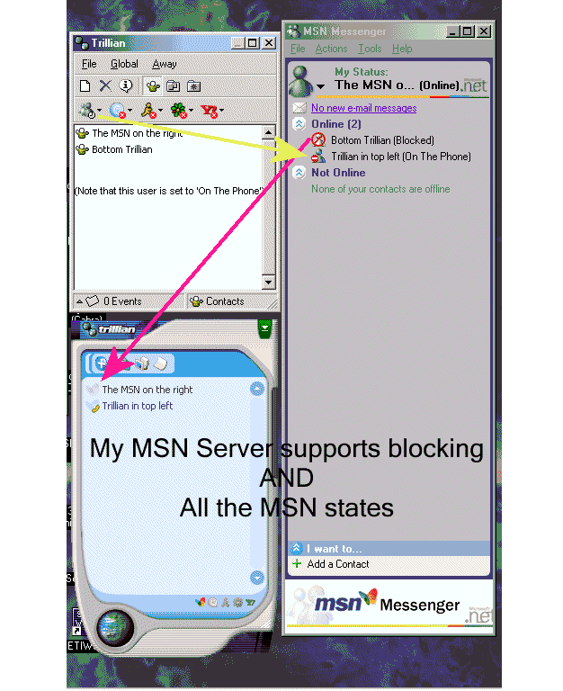



## A msn messenger SERVER, supports mutliuser chat, blocking, screen names, away states, file transf\.\.\.

### Description

This small code runs an msn messenger server. It allows for people who either don't want to, or can't, connect to the official MSN server, to still use MSN messenger and to talk to other people using the same server. This has never been done before, so, there are some bugs and a few missing features (namely contact list groups), but, otherwise this is great for a school, small office, or someone building an MSN client from the socket level and needs a good example. Also, wait for the screenshot to load, they are popular clients, with a quick registry/ini hack (.reg to simplify process included), connected to my server, talking to each other. Includes file transfer support.
 
### More Info
 

             |
---                |---
**Submitted On**   |2002-11-25 14:18:04
**By**             |[Ashley Harris](https://github.com/Planet-Source-Code/PSCIndex/blob/master/ByAuthor/ashley-harris.md)
**Level**          |Intermediate
**User Rating**    |3.8 (323 globes from 86 users)
**Compatibility**  |VB 6\.0
**Category**       |[Internet/ HTML](https://github.com/Planet-Source-Code/PSCIndex/blob/master/ByCategory/internet-html__1-34.md)
**World**          |[Visual Basic](https://github.com/Planet-Source-Code/PSCIndex/blob/master/ByWorld/visual-basic.md)
**Archive File**   |[A\_msn\_mess152201122003\.zip](https://github.com/Planet-Source-Code/ashley-harris-a-msn-messenger-server-supports-mutliuser-chat-blocking-screen-names-away-st__1-42069/archive/master.zip)

